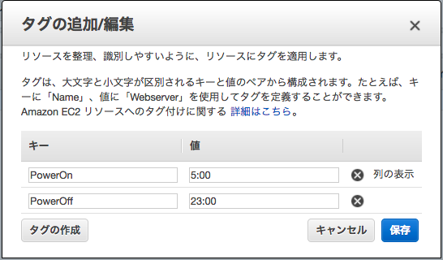

## EC2 Scheduled Power with AWS Lambda

EC2インスタンスを自動的に起動・停止するAWS Lambda Functionです．

### 使い方

以下の図のようにEC2インスタンスにタグを追加して下さい。

| タグ | 説明 |
|:----:|:----:|
| `PowerOn` | インスタンスを起動する時間 (JST) |
| `PowerOff` | インスタンスを停止する時間 (JST) |

#### 使える時間フォーマット

以下のフォーマットで記載することができます。
現在、JSTのみ対応しています。

- `1:00 pm`
- `1:00 p.m.`
- `1:00 p`
- `1:00pm`
- `1:00p.m.`
- `1:00p`
- `1 pm`
- `1 p.m.`
- `1 p`
- `1pm`
- `1p.m.`
- `1p`
- `13:00`
- `13`

#### 注意

現在、`AutoScalingGroup`で追加されたEC2インスタンスには対応できていません。

### TODO

- `AutoScalingGroup`へ対応
- 複数のTime Zoneに対応